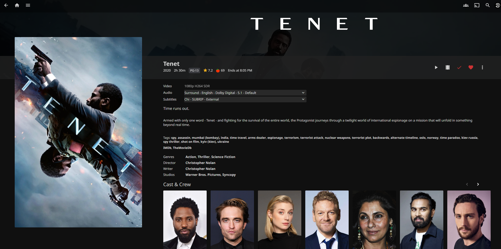

# Jellyfin Cast & Crew Portrait Fix
My Jellyfin instance has this issue where cast and crew portrait photos don't load automatically and remain blank until you manually click on each person. Even when a person has a picture hash in the database, the frontend may still display a blank image until their detail page is accessed.

This Python script solves the problem by automatically sending GET requests to every cast and crew member's detail page, which triggers Jellyfin to fetch and cache their portrait images. My run time is approximately 9 minutes for a 14TB library on Intel 12700K using all its cores.



Configure your Jellyfin API credentials in a `.env` file and run the script to populate all missing cast and crew portraits in your library.

## Setup
1. Clone this repo with `https` or `ssh`
2. Create virtual environment with `python3 -m venv .venv`
3. Activate `venv` with `source .venv/bin/activate` or `.\.venv\Script\Activate.ps1` if you are on powershell. Your prompt should have `(.venv)` prefixing shell prompt
4. Install dependencies: `pip install -r requirements.txt`
5. Create `.env` file with your Jellyfin credentials:
    ```env
    # Read .env.example for details
    API_KEY=your_jellyfin_api_key
    BASE_URL=http://your-jellyfin-ip:8096 or https://jellyfin.example.com
    USER=your_username
    USERID=your_user_id
    CORE_COUNT=MAX
    ```
6. Run `python3 main.py`
7. You will see a progress indicator showing you current/total request (% compelte)
`Progress: 44/22852 (0.2%)`

## Testing
1. If you want to add feature, please follow the [Setup](#setup) guide but use the `requirements.dev.txt` to install [Coverage.py](https://coverage.readthedocs.io/en/7.9.2/#) test suite. 
2. Try your best to make new feature test coverage 100%.
3. Start unit test with `coverage run -m unittest && coverage report` or `coverage run -m unittest; coverage report` (if on Powershell)